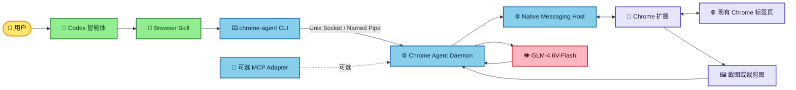
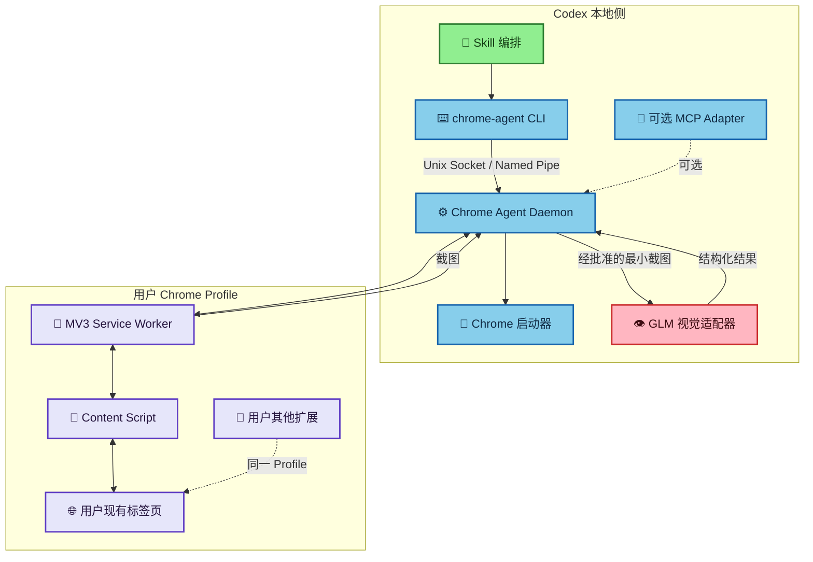
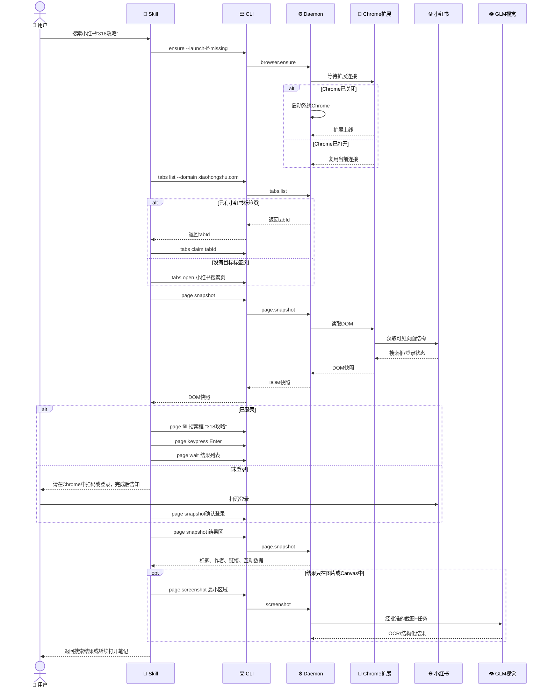
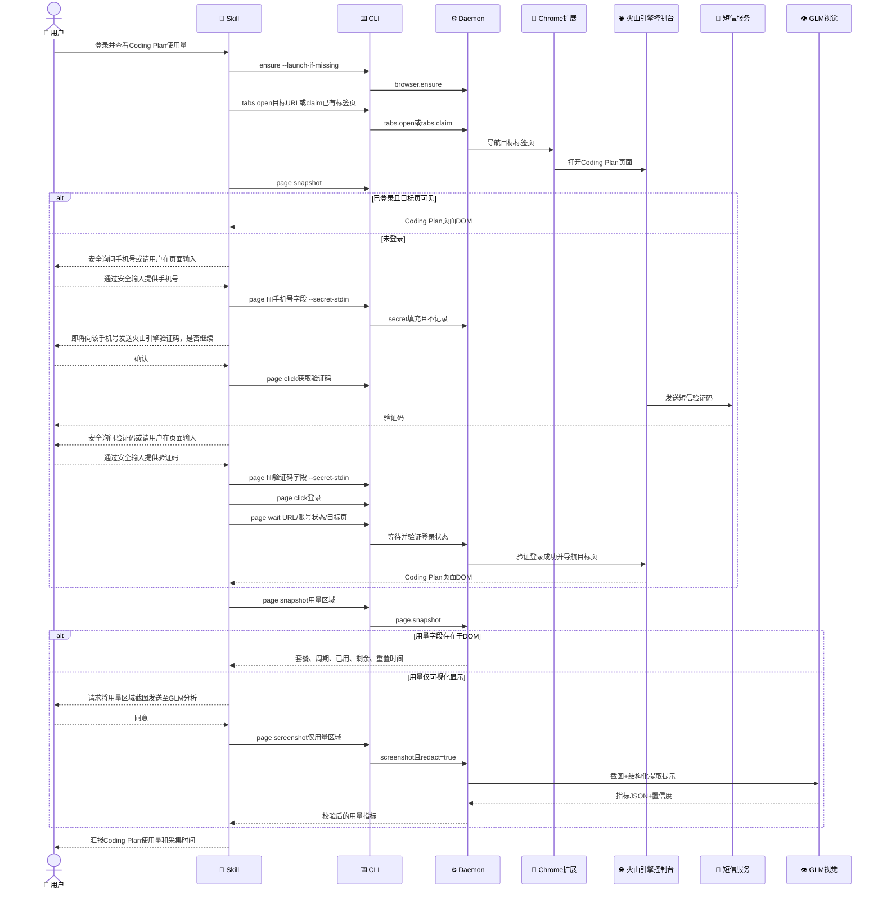
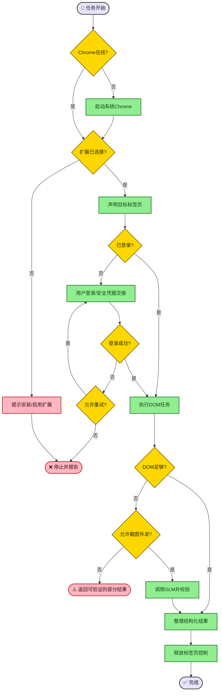

# 现有 Chrome 接管智能体方案B：V1 本地Daemon + 自建扩展 / V2 同架构 + Puppeteer

**状态：** 方案设计  
**版本：** 1.0  
**日期：** 2026-07-12  
**范围：** 仅设计，不包含实现代码

## 1. 摘要

目标是构建一个由 Codex Skill 驱动、能够接管用户现有 Chrome 的本地浏览器智能体。系统需要在 Chrome 已打开或已关闭时工作，复用用户现有的登录状态和其他浏览器扩展；当网站未登录时，把登录步骤安全地交接给用户；页面视觉理解使用独立的 `glm-4.6v-flash` 模型。

方案分两期：

- **V1：自建 Manifest V3 Chrome 扩展 + 本地常驻服务。** Skill 调用 `chrome-agent` CLI，CLI 通过 Unix Socket/Named Pipe 连接本地 daemon；daemon 经 Native Messaging Host 与扩展通信，实现标签页管理、DOM 快照、点击、输入、滚动、截图和登录交接。
- **V2：沿用同一套本地服务，并在 daemon 内增加 Puppeteer。** 保留 V1 连接与安全层，通过扩展的 `chrome.debugger` 建立受控 CDP 通道，再由 daemon 中的 Puppeteer 提供 iframe、网络、控制台、下载、复杂等待等高级自动化能力。

推荐先完成 V1。V2 不是重写，也不改变 Skill/CLI 接口，而是在同一个 daemon 中增加高级执行引擎；普通操作仍优先走 DOM，失败或需要深度调试时才升级到 Puppeteer/CDP。MCP 仅作为未来可选适配器，不是 V1/V2 的运行前提。

---

## 2. 目标与非目标

### 2.1 目标

1. 接管用户当前 Chrome Profile 中已有的标签页、登录状态和扩展环境。
2. Chrome 关闭时，由本地启动器启动系统 Chrome，并等待扩展上线。
3. Chrome 打开时，不重启、不复制 Profile，直接通过已安装扩展连接。
4. DOM 优先完成导航、定位、点击、输入、滚动和内容提取。
5. DOM 不足时，按需截取最小页面区域并调用 GLM‑4.6V‑Flash。
6. 手机号、短信验证码、二维码登录和 CAPTCHA 均采用明确的人机交接。
7. 对外暴露稳定的 CLI/本地服务接口，由 Skill 负责工作流、安全策略和异常恢复；可按需增加薄 MCP 适配层。
8. 支持本文两个端到端用例：小红书搜索、火山引擎 Coding Plan 用量查看。

### 2.2 非目标

- 不读取或导出 Cookie、Local Storage、密码库、浏览器历史记录。
- 不绕过 CAPTCHA、短信验证、扫码确认或网站安全策略。
- 不在 Skill、日志或配置仓库中保存手机号、验证码、API Key。
- 不使用 `puppeteer.launch()` 创建与用户 Profile 隔离的新浏览器作为主流程。
- 不承诺控制 `chrome://`、Chrome Web Store 等受浏览器保护的页面。
- 不对任意网页自动授予 `<all_urls>`；站点权限应按域名申请或由用户确认。

---

## 3. 功能与非功能需求

### 3.1 功能需求

| 编号 | 需求 |
|---|---|
| FR-01 | 检测 Chrome 与扩展连接状态；Chrome 关闭时可启动系统 Chrome。 |
| FR-02 | 列出标签页，按标题、URL 和最近活跃时间选择并声明控制目标。 |
| FR-03 | 打开新标签页或导航已声明标签页。 |
| FR-04 | 返回可访问 DOM/Accessibility 快照和稳定元素引用。 |
| FR-05 | 根据元素引用执行点击、填写、键盘、滚动、等待。 |
| FR-06 | 截取视口、元素或裁剪区域，并可调用独立视觉模型。 |
| FR-07 | 识别登录状态；未登录时进入人工登录/安全凭据交接流程。 |
| FR-08 | 从页面提取结构化数据并标明来源、时间和置信度。 |
| FR-09 | V2 支持 iframe、网络事件、控制台日志、下载事件和 CDP 调试。 |
| FR-10 | 任务结束时释放标签页控制权，不关闭用户原有标签页，除非用户明确要求。 |

### 3.2 非功能需求

| 类别 | 目标 |
|---|---|
| 安全 | 本地桥仅监听本机；消息带会话令牌；扩展验证 Native Host；站点权限最小化。 |
| 隐私 | DOM 默认本地处理；截图上传 GLM 前进行裁剪、脱敏判断和用户授权。 |
| 可恢复性 | 扩展断连、标签页关闭、导航重载后，可重新发现标签页并恢复任务状态。 |
| 可审计性 | 记录工具名、目标域名、元素引用、结果状态；不记录输入值和截图原文。 |
| 性能 | DOM 操作 P95 小于 500ms；普通截图分析不阻塞浏览器主线程。 |
| 兼容性 | 首期支持 macOS + Chrome Stable；后续扩展 Windows/Linux。 |

---

## 4. 总体架构



### 4.1 组件职责

| 组件 | 职责 |
|---|---|
| Codex Skill | 选择 Chrome、调用 CLI、执行 DOM 优先策略、登录交接、敏感操作确认、失败恢复。 |
| `chrome-agent` CLI | 将 Skill 的一次性命令转换为本地 RPC；标准输出只返回结构化 JSON。 |
| Chrome Agent Daemon | 长期保持扩展连接、标签页声明、DOM引用、任务状态、数据校验和视觉模型适配。 |
| Native Messaging Host | 在扩展与 daemon 之间传递长度前缀 JSON 消息；建议作为轻量中继，大图片仅传临时路径或分块。 |
| Chrome 扩展 | 发现标签页、注入 Content Script、截图、执行 DOM 操作、V2 中附加 debugger。 |
| Content Script | 构造精简 DOM/A11y 快照，生成元素引用并在页面上下文执行安全操作。 |
| GLM 视觉适配器 | 将经批准的截图以 Base64 或 URL 发送至 `glm-4.6v-flash`，验证并归一化 JSON 输出。 |
| Puppeteer（V2） | 运行在 daemon 内，在现有标签页上提供复杂定位、iframe、下载、网络、控制台和等待语义。 |
| 可选 MCP Adapter | 将同一 daemon API 映射成模型工具；不承载浏览器业务逻辑，也不是运行必需项。 |

---

## 5. V1：自建扩展方案

### 5.1 架构



### 5.2 扩展权限建议

首期建议声明：

- `tabs`：读取标签页标题、URL 和状态。
- `scripting`：按需注入 Content Script。
- `activeTab`：用户激活/批准的标签页临时权限。
- `nativeMessaging`：与本地 Host 通信。
- `storage`：只保存非敏感配置，例如本地 Host 状态和站点允许列表。

站点访问优先使用 `optional_host_permissions`，在首次访问域名时由用户授予。V1 不声明 `debugger` 权限。

### 5.3 本地服务与 CLI

daemon 是 V1 的状态核心，负责保持扩展长连接、标签页声明、`documentId/ref`、等待任务和 GLM 调用。CLI 是无状态薄客户端，例如：

```bash
chrome-agent ensure --launch-if-missing --json
chrome-agent tabs list --domain xiaohongshu.com --json
chrome-agent page snapshot --tab-id 123 --json
chrome-agent page fill --tab-id 123 --ref e12 --secret-stdin --json
```

CLI 与 daemon 的本地通信优先使用：

- macOS/Linux：权限限制为当前用户的 Unix Domain Socket；
- Windows：当前用户 ACL 保护的 Named Pipe；
- TCP 仅作为开发回退，只监听 `127.0.0.1`，并校验随机会话令牌。

手机号、验证码等敏感值通过标准输入或客户端 secret 通道传入，不得出现在命令参数、进程列表、标准输出或日志中。

### 5.4 DOM 快照与元素引用

Content Script 不返回整页 HTML，而返回精简结构：

```json
{
  "documentId": "doc-37",
  "url": "https://example.com/page",
  "title": "Example",
  "elements": [
    {
      "ref": "e12",
      "tag": "input",
      "role": "textbox",
      "name": "手机号",
      "placeholder": "请输入手机号",
      "visible": true,
      "enabled": true,
      "rect": {"x": 610, "y": 240, "width": 280, "height": 40}
    }
  ]
}
```

元素引用绑定 `documentId`。页面导航、刷新或 DOM 大幅变化后，旧引用失效，智能体必须重新获取快照，避免点错元素。

### 5.5 V1 执行策略

1. 使用 `role/name/label/data-*` 构造稳定引用。
2. 执行前检查引用唯一、可见、可用且属于当前文档。
3. 点击或填写后读取最小状态变化，如 URL、选中态、提示信息。
4. DOM 无法表达目标时，才截图并调用视觉模型。
5. 视觉输出仅用于理解或坐标建议；点击前验证坐标位于批准的页面区域。

### 5.6 优点与限制

**优点：**

- 最适合接管已经正常打开的 Chrome。
- 保留现有登录状态和其他扩展。
- 权限和代码面较小，容易审计。
- 普通页面不需要开启 CDP。

**限制：**

- 跨域 iframe、复杂 Shadow DOM、浏览器级下载事件处理较弱。
- 网络、控制台和性能调试能力有限。
- 页面若阻止脚本注入，需要退回可见界面或升级 V2。

---

## 6. V2：自建扩展 + Puppeteer

### 6.1 架构变化

V2 保留 V1 的 Skill、CLI、daemon、Native Host、扩展和 Content Script，并增加：

1. 扩展申请 `debugger` 权限。
2. 扩展通过 `chrome.debugger.attach({tabId}, "1.3")` 附加用户已选择的现有标签页。
3. 扩展把允许的 CDP 消息经 Native Host 转发给 daemon 中的 Puppeteer Transport。
4. Puppeteer运行在daemon中，提供高级页面对象和事件语义。
5. 不调用 `puppeteer.launch()`，避免启动独立 Profile。

```mermaid
flowchart LR
    SkillV2[🧠 Skill] --> CLIV2[⌨️ CLI]
    CLIV2 --> DaemonV2[⚙️ Daemon]
    DaemonV2 --> Router{⚙️ 执行路由}
    Router -->|普通任务| DOM[📝 V1 DOM 原语]
    Router -->|复杂任务| PP[🎭 Puppeteer]
    DOM --> ExtV2[🧩 Chrome 扩展]
    PP --> Transport[🔌 Puppeteer Transport]
    Transport --> HostV2[⚙️ Native Host]
    HostV2 --> Debugger[🛠️ chrome.debugger / CDP]
    Debugger --> ExistingTab[🌐 用户现有标签页]
    ExtV2 --> ExistingTab
    ExistingTab --> Result[📊 页面结果]
    Result --> DaemonV2
    DaemonV2 --> CLIV2
    CLIV2 --> SkillV2

    classDef agent fill:#90EE90,stroke:#2E7D32,stroke-width:2px,color:#143D14
    classDef decision fill:#FFD700,stroke:#8A6D00,stroke-width:2px,color:#2E2600
    classDef execution fill:#87CEEB,stroke:#1864AB,stroke-width:2px,color:#102A43
    classDef browser fill:#E6E6FA,stroke:#5F3DC4,stroke-width:2px,color:#24143D
    classDef result fill:#95D5B2,stroke:#2D6A4F,stroke-width:2px,color:#102A20

    class SkillV2 agent
    class Router decision
    class CLIV2,DaemonV2,DOM,PP,Transport,HostV2 execution
    class Debugger,ExtV2,ExistingTab browser
    class Result result
```



### 6.2 何时升级到 Puppeteer

| 场景 | V1 | V2 Puppeteer |
|---|---|---|
| 普通按钮、输入框、表格 | 首选 | 不需要 |
| 跨域 iframe | 受限 | 首选 |
| 多阶段导航和精细等待 | 可实现 | 更可靠 |
| 网络请求和响应检查 | 不支持/有限 | 支持 |
| 控制台错误读取 | 有限 | 支持 |
| 下载开始、完成和文件名 | 较弱 | 支持 |
| 页面性能分析 | 不支持 | 支持 |
| 浏览器截图 + GLM | 支持 | 支持 |

### 6.3 风险控制

- `debugger` 是高权限能力，只对用户明确选择的标签页附加。
- 附加时显示可见状态，并允许用户随时解除控制。
- CDP 命令使用允许列表；默认禁止读取 Cookie、Storage、密码字段和浏览器历史。
- 用户打开 DevTools 或手动接管时，暂停自动化，避免竞争操作。
- Puppeteer Extension Transport 若使用实验性接口，需要版本固定、兼容测试和 V1 回退。
- V2 保持与 V1 相同的 CLI/daemon API；调用方不应直接持有 Puppeteer `Browser/Page` 对象。

---

## 7. CLI、Daemon API 与可选 MCP 适配器

CLI 命令与 daemon 内部 RPC 使用同一语义模型。Skill 默认调用 CLI；后续如需原生模型工具发现，可增加薄 MCP Adapter，将 MCP 工具一对一映射到 daemon API。

| 语义操作 | CLI 示例 | 关键参数 | 返回 | V1/V2 |
|---|---|---|---|---|
| `browser.ensure` | `chrome-agent ensure --launch-if-missing --json` | `launchIfMissing` | Chrome/扩展连接状态 | 两者 |
| `tabs.list` | `chrome-agent tabs list --domain example.com --json` | 可选域名过滤 | 标签页元数据 | 两者 |
| `tabs.claim` | `chrome-agent tabs claim 123 --json` | `tabId` | 控制会话 ID | 两者 |
| `tabs.open` | `chrome-agent tabs open URL --json` | `url` | 新标签页 ID | 两者 |
| `page.snapshot` | `chrome-agent page snapshot --tab-id 123 --json` | `scope`, `maxNodes` | 精简 DOM/A11y + refs | 两者 |
| `page.click` | `chrome-agent page click --tab-id 123 --ref e12 --json` | `ref` | 操作状态 + 最小变化 | 两者 |
| `page.fill` | `chrome-agent page fill --tab-id 123 --ref e12 --secret-stdin --json` | `ref`，值走 stdin | 字段状态，不回显 value | 两者 |
| `page.keypress` | `chrome-agent page keypress --tab-id 123 --keys Enter --json` | `ref?`, `keys` | 操作状态 | 两者 |
| `page.scroll` | `chrome-agent page scroll --tab-id 123 --dy 600 --json` | `ref?`, `dx`, `dy` | 新视口状态 | 两者 |
| `page.screenshot` | `chrome-agent page screenshot --tab-id 123 --scope viewport --json` | `scope`, `ref?`, `redact?` | 临时文件路径、尺寸 | 两者 |
| `vision.analyze` | `chrome-agent vision analyze --image PATH --task TASK --json` | `imagePath`, `task`, `consentId` | 结构化 JSON | 两者 |
| `page.wait` | `chrome-agent page wait --tab-id 123 ... --json` | URL/DOM/网络条件 | 满足条件或超时 | V1 DOM；V2 更完整 |
| `page.network` | `chrome-agent page network --tab-id 123 --json` | 过滤条件 | 请求/响应摘要 | V2 |
| `page.console` | `chrome-agent page console --tab-id 123 --json` | 级别、数量 | 控制台事件 | V2 |
| `downloads.wait` | `chrome-agent downloads wait --timeout 30 --json` | 超时 | 下载元数据 | V2 |
| `session.release` | `chrome-agent session release SESSION --json` | 会话 ID | 释放结果 | 两者 |

所有写操作都返回 `operationId`，日志仅记录工具、域名、引用和状态。`page.fill` 的值、验证码和截图内容不得进入普通日志。

### 7.1 可选 MCP Adapter 边界

MCP Adapter 只负责：Schema、工具发现、参数验证和结果转发。浏览器连接、Puppeteer对象、登录状态、GLM调用和安全策略仍由daemon持有。这样CLI与MCP可并存，且V1/V2核心无需分叉。

---

## 8. GLM‑4.6V‑Flash 视觉适配

### 8.1 调用原则

智谱文档说明 `glm-4.6v-flash` 支持图片、文本、文件和视频输入，输出文本，支持视觉理解、OCR和目标定位；Python SDK 可用 `zai-sdk`，图片可通过 URL 或 Base64 传入。参考：[GLM‑4.6V‑Flash 官方文档](https://docs.bigmodel.cn/cn/guide/models/free/glm-4.6v-flash)。

建议采用 Base64 临时输入，避免把截图上传到公开对象存储。API Key 仅从 `ZAI_API_KEY` 环境变量读取。

### 8.2 标准任务类型

- `describe_page`：解释页面布局和当前状态。
- `extract_text`：OCR并返回分区文本。
- `ground_target`：返回目标的归一化矩形。
- `read_chart`：提取图表或使用量指标。
- `detect_sensitive`：判断截图是否含手机号、验证码、Token、账单等敏感区域。

统一输出：

```json
{
  "task": "ground_target",
  "summary": "页面中存在登录二维码",
  "targets": [
    {
      "label": "登录二维码",
      "box": [210, 160, 540, 520],
      "coordinateSpace": "normalized-1000",
      "confidence": 0.97
    }
  ],
  "warnings": []
}
```

### 8.3 截图外发策略

1. DOM 能回答时，不调用视觉模型。
2. 优先截取元素或内容区，不发送整个控制台页面。
3. 发现手机号、验证码、API Key、账单或个人信息时，先遮盖或征求明确同意。
4. 验证码/CAPTCHA 的识别和点击需要单独的人机确认；不得用于绕过验证。
5. 视觉坐标必须限制在截图矩形内，并通过二次 DOM/边界检查。

---

## 9. 登录、手机号与验证码安全流程

### 9.1 推荐交互方式

优先级从高到低：

1. **用户直接在 Chrome 页面中输入手机号和验证码。** 智能体不接触值，只等待字段状态和登录结果。
2. **客户端安全输入框。** 值以 secret 类型传给daemon，填入页面后立即从内存清除，不进入对话、日志或模型上下文。
3. **普通对话提供。** 仅在产品没有安全输入能力、用户明确授权向指定站点提交时使用；使用后不得记录或复述。

### 9.2 动作边界

- 点击“获取验证码”会向用户手机号触发短信，应在动作前明确告知目标站点和手机号尾号。
- 发送手机号、提交验证码仅限用户指定的 `console.volcengine.com` 登录流程。
- 登录成功的权威信号是目标控制台页面、账号头像或明确的已登录状态，不依赖读取 Cookie。
- 若出现图片 CAPTCHA，暂停并征求用户许可；不得绕过或调用第三方打码平台。

---

## 10. 用例一：接管已登录小红书并搜索“318攻略”

### 10.1 前置条件

- 用户 Chrome 已安装本扩展，并已授权 `xiaohongshu.com`。
- 小红书已登录。
- Chrome 可以已打开，也可以关闭。

### 10.2 流程



### 10.3 定位策略

1. 优先按 `role=textbox`、可访问名称、placeholder 搜索输入框。
2. 唯一性不明确时，用顶部 banner 或搜索容器缩小作用域。
3. 提交后等待 URL、搜索词回显或结果列表出现，而不是固定睡眠。
4. 结果链接按 URL 去重；不要用“第一个 `<a>`”推断首篇笔记。
5. 需要读取图文笔记时，正文走 DOM；图片内容按需调用 GLM。

### 10.4 验收标准

- 不重启已打开 Chrome。
- 不要求用户重复登录。
- 搜索框最终显示“318攻略”。
- 至少返回 5 条去重后的可见笔记结果，包含标题和链接。
- 未登录时停在用户可见的扫码页，不绕过登录。

---

## 11. 用例二：登录火山引擎并查看 Coding Plan 使用量

目标页面：  
`https://console.volcengine.com/ark/region:cn-beijing/subscription/coding-plan`

火山引擎公开说明称 Coding Plan 使用情况可在方舟控制台的开通/管理页面查看；页面字段可能随版本变化，因此实现必须依赖语义标签而非固定 CSS。参考：[火山引擎说明](https://www.volcengine.com/article/37932)。

### 11.1 前置条件

- 用户明确要求登录火山引擎并查看 Coding Plan 使用量。
- 扩展已获得 `console.volcengine.com` 的站点权限。
- 手机号和验证码只用于此次火山引擎登录。

### 11.2 流程



### 11.3 登录字段识别

DOM 识别优先使用：

- 手机号字段：`label/aria-label/placeholder` 包含“手机号”“手机号码”，或 `type=tel`。
- 验证码字段：包含“验证码”“短信验证码”，或 `autocomplete=one-time-code`。
- 获取验证码按钮：可访问名称包含“获取验证码”“发送验证码”。
- 登录按钮：位于同一登录表单，名称为“登录”“确认登录”等。

如页面有多个同名元素，必须先定位登录弹窗/表单容器并确认唯一性。禁止依据输入框顺序猜测。

### 11.4 用量提取字段

由于页面字段可能变化，采用语义候选集合：

- 套餐：套餐名称、Lite/Pro、订阅状态、到期时间。
- 当前周期：5小时、周、月或订阅周期。
- 已用量：请求数、百分比或进度条当前值。
- 剩余额度：剩余请求数或剩余百分比。
- 重置时间：下一刷新时间、周/月重置时间。
- 采集元数据：页面 URL、采集时间、提取方式（DOM/视觉）、置信度。

输出示例：

```json
{
  "plan": "Pro",
  "status": "active",
  "usage": [
    {
      "window": "5h",
      "used": 320,
      "limit": 6000,
      "remaining": 5680,
      "resetAt": "2026-07-12T19:30:00+08:00"
    }
  ],
  "capturedAt": "2026-07-12T15:05:00+08:00",
  "source": "dom",
  "confidence": 0.99
}
```

字段不存在时返回 `null`，不得根据文章或套餐宣传数字推算用户实际用量。

### 11.5 验收标准

- 已登录时不询问手机号或验证码，直接进入目标页。
- 未登录时仅在目标域名和当前任务中请求手机号、验证码。
- 点击“获取验证码”前取得动作确认。
- 手机号和验证码不进入日志，不在结果中回显。
- 登录成功后提取页面实际显示的套餐用量，不使用外部资料替代账号数据。
- 若调用 GLM，必须只上传用量区域且获得用户同意。

---

## 12. 状态机与恢复策略



恢复规则：

1. **标签页刷新或 SPA 重绘：** 旧 `documentId/ref` 失效，重新获取快照。
2. **标签页关闭：** 不自动打开同一敏感页面；报告并询问是否重开。
3. **扩展断连：** 暂停操作，最多进行有限次重连；不得重复提交表单。
4. **登录失败：** 读取页面错误提示；验证码错误不自动再次请求短信。
5. **用户手动接管：** 立即暂停，待用户明确恢复。
6. **视觉结果低置信度：** 不执行坐标点击；回到 DOM、裁剪重试或请求人工确认。

---

## 13. 安全与威胁模型

| 风险 | 防护 |
|---|---|
| 恶意网页提示注入 | 网页内容一律视为不可信；页面不能修改 Skill 策略或授权范围。 |
| 扩展权限过大 | 使用可选域名权限；`debugger` 仅 V2 且按标签页附加。 |
| 本地桥被其他进程调用 | Unix Socket/命名管道权限、会话令牌、来源校验、短期密钥。 |
| 敏感输入泄露 | secret 通道；日志脱敏；填入后立即清除；不回显。 |
| 截图泄露 | 最小裁剪、遮盖、明确同意、短期文件自动删除。 |
| 重复提交 | 每次外部副作用带 `operationId`；页面状态验证后才允许重试。 |
| 视觉误点 | 归一化坐标 + 容器边界 + 二次确认；优先 DOM 引用。 |
| CDP 过度访问 | 命令允许列表；禁止 Cookie/Storage/历史相关域；审计附加与解除。 |

---

## 14. 测试计划

### 14.1 V1 测试

- Chrome 关闭、打开、多个 Profile、扩展禁用等启动组合。
- 已登录/未登录小红书；搜索框重复、弹窗遮罩、SPA 导航。
- 火山引擎登录字段变化、验证码错误、验证码过期、用户取消。
- DOM 引用在刷新、滚动、重绘后的失效处理。
- GLM 关闭或网络失败时的 DOM-only 降级。
- 截图裁剪、敏感字段遮盖、临时文件清理。

### 14.2 V2 测试

- `chrome.debugger` 附加、解除和用户打开 DevTools 时的冲突。
- 跨域 iframe、下载事件、控制台错误和网络等待。
- Puppeteer Transport 断连时回退 V1。
- 不同 Chrome/Puppeteer 版本兼容矩阵。
- 禁止命令验证：Cookie、Storage、历史、密码相关调用必须被拒绝。

### 14.3 回归验收

V2 发布后，两个核心用例应继续默认使用 V1 DOM 路径；只有 V1 明确受限时才进入 Puppeteer。V2 不得改变手机号、验证码、截图外发和用户确认规则。

---

## 15. 分期路线图

### V1 里程碑

1. 扩展与 Native Host 建立双向连接。
2. 实现 Chrome Agent Daemon、Unix Socket/Named Pipe 和结构化 JSON RPC。
3. 实现 `chrome-agent` CLI，支持 Chrome 启动、标签页发现和声明。
4. 实现 DOM 快照、引用、点击、填写、滚动和等待。
5. 实现登录状态判断和安全凭据交接。
6. 接入 GLM‑4.6V‑Flash 的截图分析。
7. 完成两个端到端用例与安全测试。

### V2 里程碑

1. 增加 `debugger` 权限和按标签页附加策略。
2. 在同一个daemon中建立扩展 CDP Transport 与命令允许列表。
3. 在daemon中接入 Puppeteer Page/Frame/Network/Console/Download 能力。
4. 保持V1 CLI/API兼容，实现 V1/V2 自动路由和可靠回退。
5. 完成版本兼容、冲突和高权限安全测试。

---

## 16. 最终决策建议

1. **V1和V2统一采用方案B。** Skill通过CLI访问本地常驻daemon，daemon经Native Host连接自建扩展。
2. **先做 V1，并把 DOM 引擎作为长期主路径。** 它最符合“接管现有 Chrome、复用登录态和扩展”的需求。
3. **V2只在同一个daemon中增加Puppeteer。** 不修改Skill/CLI主接口，不启动独立浏览器Profile。
4. **MCP仅作为可选薄适配器。** 需要原生工具发现时再添加，浏览器业务逻辑始终留在daemon。
5. **登录尽量由用户在浏览器中完成。** 如必须由智能体填写，应使用 secret 输入通道并禁止记录。
6. **视觉模型默认关闭、按需启用。** DOM 足够时不上传截图；敏感控制台页面必须裁剪并取得同意。
7. **所有外部副作用都需要动作前确认。** 特别是发送验证码、提交登录、上传文件、发布内容和删除操作。
