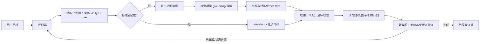

# 智能体操控浏览器、电脑与手机：技术路线与产品调研

> 调研日期：2026-08-20  
> 适用项目：Chrome Agent  
> 结论依据：优先采用官方文档、官方 GitHub 仓库与论文；产品能力会持续变化，上线前应再次核对供应商文档。

## 1. 核心结论

当前不存在一套执行技术能同时以最高质量覆盖浏览器、桌面和手机。三类环境的最佳工程路线分别是：

| 环境 | 优先路线 | 视觉的合理位置 | 当前成熟度 |
|---|---|---|---|
| 浏览器 | DOM / Accessibility / CDP 优先，视觉兜底 | DOM 无法识别 Canvas、图片按钮、复杂组件或页面结构失真时 | 最高，适合生产 |
| 桌面 | OS Accessibility/UI Automation + 原生 API，视觉兜底；无法访问结构时使用纯截图控制 | 自绘控件、远程桌面、游戏/设计软件、跨应用定位 | 中等，长任务可靠性仍有限 |
| 手机 | Android：ADB + UIAutomator/Appium + 截图；iOS：XCTest/Appium + 截图 | 图标、图片、WebView、无可访问性节点的控件 | Android 中等；iOS 受平台限制更大 |

对本项目最重要的判断：

1. 现有 `Skill → CLI → daemon → Native Host → Chrome 扩展 → DOM` 架构是正确的生产起点，不应被纯视觉方案替换。
2. 第二阶段应实现“结构化信息优先、视觉按需升级”的混合控制器，而不是每一步都把全屏截图发给多模态模型。
3. 视觉模型不应直接连接 Chrome 扩展。截图裁剪、脱敏、模型路由、坐标换算、重试和审计应放在 daemon。
4. 桌面和手机控制应作为新的 executor/device adapter 接入，不应把平台逻辑塞进 Chrome 扩展。
5. Coding agent 在手机网页/App 中可被用户远程发起和管理，不等于它能控制手机 UI；必须在产品表中区分“控制入口”和“被控制终端”。

## 2. 先统一概念

### 2.1 三种容易混淆的能力

| 能力 | 例子 | 是否属于终端 UI 控制 |
|---|---|---|
| 智能体在浏览器/电脑/手机 UI 上点击、输入、滚动 | Computer Use、Android Agent | 是 |
| 用户通过手机 App 远程发起一个云端 coding agent | Cursor Web & Mobile、GitHub Mobile、Codex mobile handoff | 否；手机只是控制台 |
| Coding agent 用 Playwright/CDP 测试自己开发的网页 | Codex 浏览器工具、Replit App Testing | 是浏览器自动化，但通常不等于接管用户日常 Chrome |

### 2.2 四类感知与执行技术

1. **结构化网页控制**：DOM、Accessibility Tree、Playwright、CDP、扩展 Content Script。定位准确、成本低、结果易验证，但难处理 Canvas、图片和浏览器外 UI。
2. **结构化原生 UI 控制**：Windows UIA、macOS Accessibility、Android UIAutomator、iOS XCTest。比坐标点击稳定，但受应用暴露的可访问性信息质量限制。
3. **纯视觉 Computer Use**：截图交给视觉语言模型，模型输出点击坐标、输入、滚动等动作。覆盖范围最广，但成本、延迟、误点和安全风险更高。
4. **混合控制**：同时向模型提供截图和结构化节点，优先执行可验证的 ref/selector，必要时退化为坐标。这是当前最有工程价值的路线。

## 3. 浏览器控制：开源项目对比

| 项目 | 定位与主要功能 | 技术方案 | 视觉能力 | 适用判断 |
|---|---|---|---|---|
| [browser-use](https://github.com/browser-use/browser-use) | 通用 Web Agent 框架；浏览、表单、提取、任务循环 | Python；浏览器状态抽取 + LLM 工具调用；围绕浏览器会话编排 | 支持截图/视觉模型，通常与 DOM 状态结合 | 上手快、社区活跃；适合作为 Agent 编排参考，不是接管现有 Chrome 的唯一底座 |
| [Microsoft Playwright MCP](https://github.com/microsoft/playwright-mcp) | 把 Playwright 浏览器能力作为 MCP 工具提供给智能体 | Accessibility snapshot/Playwright locator 为主，工具接口标准化 | 可用截图辅助，但核心优势是结构化快照，不依赖视觉模型 | 最适合 coding agent 做网页测试和通用浏览；默认浏览器上下文与用户现有 Profile 需谨慎处理 |
| [Stagehand](https://github.com/browserbase/stagehand) | `act/extract/observe` 高层浏览器自动化 SDK | Playwright/CDP + 模型推理；把自然语言操作转成可缓存动作 | 支持计算机使用模型与页面视觉，强调混合式自动化 | 适合产品化浏览器任务、远端浏览器与可观测性；比原始 Playwright 抽象更高 |
| [BrowserGym](https://github.com/ServiceNow/BrowserGym) | Web Agent 环境、任务和评测框架 | Gym 环境 + 浏览器观测/action space；可接 WebArena、MiniWoB 等 | 可研究 DOM、A11y、截图及组合观测 | 更适合研发和评测，不是直接面向用户的浏览器控制产品 |
| [VisualWebArena](https://github.com/web-arena-x/visualwebarena) | 视觉网页任务基准 | 自托管网站 + 视觉/文本观测 + 可复现实验 | 是；重点验证仅靠文本无法完成的视觉任务 | 用于衡量视觉能力增益，不宜作为生产执行框架 |
| [Skyvern](https://github.com/Skyvern-AI/skyvern) | 面向复杂业务流程、表单和网页工作流 | 浏览器执行 + LLM/VLM；减少对固定 selector 的依赖 | 原生使用视觉和页面理解 | 适合抗页面变动的业务自动化；部署、成本和动作可控性需单独评估 |

### 3.1 浏览器路线的质量排序

对于需要可靠获取内容、提交表单或下载文件的任务，建议按以下顺序升级：

```text
确定性 API / 网络接口
  → DOM / Accessibility ref
  → Playwright/CDP 高级能力
  → DOM + 局部截图的多模态判断
  → 纯截图坐标控制
  → 人工接管
```

原因是前面的方案更容易保证“点了什么、为什么点、结果是否正确”。纯视觉的优势不是替代 DOM，而是补齐 DOM 看不到或语义不足的区域。

## 4. 电脑控制：开源项目对比

| 项目 | 平台与能力 | 技术方案 | 多模态集成方式 | 评价 |
|---|---|---|---|---|
| [Agent-S](https://github.com/simular-ai/Agent-S) | 通用电脑使用智能体，强调规划、记忆和经验复用 | 层级规划 + GUI grounding + action loop；对接多种 CUA/VLM | 截图进入模型，grounding 生成操作目标，结合轨迹记忆与错误恢复 | 研究与框架价值高，适合比较不同模型；真实桌面长期任务仍需安全层和验证器 |
| [UI-TARS](https://github.com/bytedance/UI-TARS) / [UI-TARS Desktop](https://github.com/bytedance/UI-TARS-desktop) | 原生 GUI Agent 模型和桌面客户端 | 端到端视觉语言动作模型；输入截图，输出坐标/键鼠动作 | 视觉是主感知通道；需严格处理缩放、绝对/归一化坐标 | 开源视觉 GUI 模型代表路线，适合本地/私有化实验；工程侧仍要补执行、权限与审计 |
| [Microsoft UFO](https://github.com/microsoft/UFO) | Windows 单机、多应用及跨设备工作流 | Windows UIA、Win32/COM、视觉检测、MCP action server；HostAgent + AppAgent | UIA/原生 API 优先，视觉识别自绘控件；动作后读取 UI 状态验证 | 混合路线代表，Windows 场景最值得参考；平台相关性强 |
| [Open Interpreter](https://github.com/OpenInterpreter/open-interpreter) | 本地自然语言电脑助手，主要让模型执行 Python/JS/Shell | function calling + 本地代码执行，可调用 OS/浏览器自动化库 | 视觉/电脑控制可由模型和脚本扩展，但核心不是专门 GUI grounding | 文件和系统任务强；直接执行任意代码风险高，需要沙箱与确认 |
| [OSWorld](https://github.com/xlang-ai/OSWorld) | 真实电脑环境的跨应用评测基准 | 虚拟机/容器化 OS、可复现任务、截图和结构化状态评测 | 用于评测截图式与结构式桌面 Agent | 应作为回归测试基准参考，不是生产 Agent SDK |

### 4.1 桌面控制的现实边界

- 浏览器内操作通常比跨应用桌面操作稳定，因为浏览器有较统一的 DOM/CDP。
- Windows UIA 的自动化生态最完整；macOS Accessibility 可用但权限审批和应用差异明显；Linux 桌面碎片化更高。
- 纯视觉模型可以覆盖任意可见界面，但不能天然知道点击是否命中正确对象，也不知道背后是否发生不可逆操作。
- RDP、虚拟桌面、沙箱 VM 比直接控制用户主桌面更适合无人值守任务；直接控制用户桌面则更适合短任务和人在回路。

## 5. 手机控制：开源项目对比

| 项目 | 定位 | 技术方案 | 视觉能力 | 评价 |
|---|---|---|---|---|
| [Appium](https://github.com/appium/appium) | Android/iOS 跨平台 UI 自动化标准工具链 | WebDriver；Android 驱动通常连接 UiAutomator2，iOS 连接 XCUITest | 本身不是智能体视觉模型，可由 Agent 在外层使用截图和 page source | 工程执行层最成熟；适合把稳定动作封成工具，不负责规划 |
| [AndroidWorld](https://github.com/google-research/android_world) | Android Agent 环境与动态基准，116 类任务、20 个 App | Emulator + ADB + Accessibility/UI 元素 + 可验证任务状态 | 示例 Agent 可同时使用截图和 UI 元素 | 评测和开发 Android Agent 的首选参考之一，不是 Google 正式产品 |
| [Mobile-Agent](https://github.com/X-PLUG/MobileAgent) | 面向手机 GUI 的多模态 Agent 系列 | 截图、OCR/图标检测或端到端 VLM + ADB 动作；包含规划/反思方向 | 视觉是核心，支持从画面定位 App 和控件 | 研究前沿、覆盖纯视觉路线；需自行补设备管理、安全与生产稳定性 |
| AppAgent | 通过探索和文档生成来操作手机 App | VLM 观察截图，先探索 App、积累操作知识，再执行用户任务 | 截图 + 视觉语义推理 | “先探索再执行”对陌生 App 有启发；探索成本和版本漂移要管理 |
| [DroidRun](https://github.com/appwiz/droidrun) | LLM 无关的 Android 自然语言自动化框架 | 设备端组件/ADB、可访问性信息、截图、Agent 工具接口 | 可接多种视觉模型 | 更接近可落地 Android agent runner；生态和长期兼容性需持续验证 |
| [Microsoft UFO MobileAgent](https://github.com/microsoft/UFO) | UFO³ 中的 Android device agent | ADB 截图、`uiautomator dump`、点击/滑动/输入、MCP 数据与动作服务 | screenshot + 标注控件 + UI hierarchy 一起发送给模型 | 混合感知和跨设备编排设计完整，适合作为本项目未来 device adapter 参考 |

### 5.1 Android 与 iOS 的差异

- **Android**：ADB 可截屏、点击、滑动、输入、启动 App，UIAutomator 可导出控件树，因此开源智能体大多先支持 Android。
- **iOS**：通常通过 XCUITest/WebDriverAgent/Appium 控制；安装签名、设备配对、权限和后台执行约束更严格。越权控制真实个人设备不适合作为通用产品假设。
- 模拟器便于重置、评测和并行；真实设备才覆盖登录态、推送、相机、定位、生物识别等真实条件，但安全和稳定性成本显著增加。

## 6. 商业能力与 coding plan 对比

以下比较关注“产品当前公开支持到哪里”，不把模型 API、coding agent 和终端 UI 控制混为一谈。

| 厂商/产品 | 浏览器 | 电脑 | 手机 | 多模态视觉与关键边界 |
|---|---|---|---|---|
| OpenAI Codex / ChatGPT / Computer Use API | Codex 应用提供浏览器能力；API 的 computer tool 可执行网页 UI 动作 | Codex 桌面应用逐步加入本机电脑操作；API 需要开发者提供执行环境 | ChatGPT 手机端可远程监督/继续 Codex 任务；这不等于控制其他手机 App | Computer Use 是 screenshot → 模型动作 → 客户端执行 → 新截图闭环；高风险动作需确认。官方文档：[Computer use](https://developers.openai.com/api/docs/guides/tools-computer-use)、[Codex app](https://openai.com/index/introducing-the-codex-app/)、[移动端远程协作](https://openai.com/index/work-with-codex-from-anywhere/) |
| Anthropic Claude Code / Computer Use | Claude/开发者可通过 Computer Use 工具控制浏览器环境；Claude Code 本体仍以终端和代码工具为核心 | Computer Use API 支持截图、鼠标和键盘，开发者必须实现/托管执行环境 | 没有公开的通用“Claude 控制用户 iOS/Android 全系统 UI”coding plan 能力 | 工具版本化；截图按视觉输入计费；官方强调隔离环境、最小权限和人在回路。[Computer Use 文档](https://platform.claude.com/docs/en/agents-and-tools/tool-use/computer-use-tool) |
| Google Gemini Computer Use / Project Mariner | 浏览器是最成熟目标；模型读取截图和动作历史，输出 UI action | 新版 Gemini Computer Use 文档已覆盖浏览器、移动和桌面，但执行环境仍由开发者提供 | 模型层支持移动 UI action，不等于 Gemini 消费者 App 可任意控制手机 | 原生多模态 screenshot grounding；支持安全意图、动作确认及提示注入检测。[Gemini Computer Use API](https://ai.google.dev/gemini-api/docs/computer-use) |
| Microsoft Copilot Studio / Azure AI Foundry | 托管浏览器、企业网页自动化和 agent browser automation | Copilot Studio Computer Use 面向企业 UI 自动化，可操作网站和桌面应用 | 公开商业重点不是通用个人手机 UI Agent | 企业工作流、治理和托管执行环境较强；与 GitHub Copilot coding agent 是不同产品。[Copilot Studio Computer Use](https://www.microsoft.com/en-us/microsoft-copilot/blog/copilot-studio/announcing-computer-use-microsoft-copilot-studio-ui-automation)、[Azure Browser Automation](https://learn.microsoft.com/en-us/azure/foundry/agents/how-to/tools/browser-automation) |
| GitHub Copilot coding agent | 可联网、运行代码和测试；浏览器不是面向用户登录态的通用操作器 | 主要在云端开发环境修改仓库、运行 CI/测试，不控制个人电脑桌面 | GitHub Mobile 可发起/管理 cloud agent；不是手机 UI 控制 | 以代码、仓库、终端和 PR 为中心；可通过 MCP/工具扩展，但权限由平台和仓库策略限定。[Coding agent 文档](https://docs.github.com/en/copilot/concepts/agents/coding-agent/about-coding-agent) |
| Cursor Agent | 本地 Agent 可用 Web 搜索和终端；Background Agent 在远端 VM，可自行启动测试浏览器，但不是默认接管个人 Chrome | 本地能力集中于编辑器、文件和终端；后台 Agent 控制隔离 Linux VM | Web/Mobile PWA 用于启动、查看、接管后台编码任务 | 官方把手机定位为 Agent 控制台。[Web & Mobile](https://docs.cursor.com/en/background-agent/web-and-mobile)、[Background Agents](https://docs.cursor.com/background-agent) |
| Windsurf | 以 IDE、终端、预览和网页开发调试为主；浏览能力随产品版本变化，应按当前文档核对 | 主要控制 IDE 工具和开发命令，不是通用桌面 CUA | 无公开通用手机 UI 控制能力 | Coding plan 与终端 UI 控制是两类产品；可通过 MCP/浏览器工具扩展 |
| Replit Agent | 在云开发环境生成应用，并可通过 App Testing 在浏览器中点击和验证自己构建的网页 | 控制 Replit 云工作区，不控制用户个人桌面 | 手机端可管理构建工作流，不等于操作手机其他 App | 视觉主要用于网页应用测试和结果检查，不是个人设备 Computer Use |
| Browserbase + Stagehand | 托管浏览器、会话、代理、可观测性，Stagehand 提供高层自然语言浏览动作 | 不主打用户本机桌面 | 不主打真实手机 UI | 适合构建生产 browser agent 基础设施；会话在云端浏览器而非用户现有 Chrome。[Browserbase](https://docs.browserbase.com/welcome/what-is-browserbase)、[Stagehand](https://docs.stagehand.dev/v4/first-steps/introduction) |
| Manus Browser Operator | 浏览器扩展可复用用户现有登录会话执行网页任务 | 公开能力重点仍是浏览器，不是全桌面通用控制 | 不等于原生手机 App 控制 | 与本项目形态接近：扩展是本机执行手，Agent 在外层规划。[官方介绍](https://manus.im/blog/manus-browser-operator) |

### 6.1 对“各家 coding plan 都支持浏览器”的准确解释

它们至少包含三种不同实现：

1. **云端 Agent 的联网/搜索工具**：能搜索网页，但不一定有可交互浏览器。
2. **隔离环境内浏览器测试**：能启动 Chromium 测试本项目，不能复用用户日常 Chrome 登录态。
3. **用户浏览器/电脑接管**：需要 Chrome 扩展、本地桥、桌面客户端或 Computer Use runtime；权限和风险最高，提供者最少。

因此采购或选型时必须追问：浏览器运行在哪里、是否复用现有 Profile、是否支持下载、能否处理 iframe/弹窗、截图是否上传、敏感操作如何确认，而不能只看“Browser”标签。

## 7. 多模态视觉如何正确集成

### 7.1 推荐闭环



### 7.2 模型接口不应只返回坐标

建议 daemon 内部统一视觉输出：

```json
{
  "intent": "click",
  "target": {
    "description": "搜索按钮",
    "point_normalized": [0.83, 0.14],
    "box_normalized": [0.79, 0.10, 0.88, 0.18],
    "candidate_ref": "e17",
    "confidence": 0.91
  },
  "expected_effect": "出现搜索结果列表",
  "requires_confirmation": false
}
```

执行器应完成以下校验后才能点击：

- 截图对应的 tab/window/device、document ID 和时间戳仍有效；
- 视口尺寸、device pixel ratio、浏览器 zoom、页面滚动量和手机旋转方向一致；
- 坐标在已授权窗口/标签页内，不在地址栏、扩展栏或系统危险区域；
- 若存在 `candidate_ref`，其 rect 与视觉框重叠；
- 删除、支付、发送、发布、权限修改、下载可执行文件等动作进入确认策略。

### 7.3 三种视觉模型接入方式

| 接入方式 | 示例 | 优点 | 缺点 | 建议用途 |
|---|---|---|---|---|
| 通用 VLM + 自定义 JSON grounding | Qwen-VL、GLM-V、Gemini Vision 等 | 供应商可替换，容易做局部图理解和抽取 | 动作协议、坐标和重试都要自建 | 本项目近期最合适 |
| 原生 Computer Use 模型 | OpenAI、Claude、Gemini Computer Use | 模型已经学习 GUI action loop，规划与 grounding 一体化 | 供应商协议不同、成本较高、可控性较弱 | 作为高级执行策略或对照组 |
| 本地 GUI 专用模型 | UI-TARS 等 | 数据不出本机、可微调、可批量评测 | GPU、部署、模型升级和端侧延迟成本 | 隐私或规模达到一定程度后 |

### 7.4 视觉集成的六个工程重点

1. **按需截屏**：先发局部区域；全屏只用于发现目标。缩小成本和隐私暴露面。
2. **坐标系统统一**：模型统一输出 `[0,1]` 归一化坐标，daemon 再转换为 CSS px、屏幕 px 或设备 px。
3. **混合绑定**：视觉模型发现目标后，尽量绑定回 DOM/A11y/UI tree 节点，用节点动作执行。
4. **动作后验证**：每一步定义 `expected_effect`，使用 URL、DOM diff、控件状态和新截图共同确认。
5. **提示注入隔离**：网页或截图里的文字是非可信数据，不能覆盖系统策略；对“上传文件、泄露密钥、忽略规则”等页面指令单独检测。
6. **可回放性**：保存脱敏后的 observation hash、模型输出、动作和状态 diff；不要默认永久保存原始截图和输入内容。

## 8. 对 Chrome Agent 的具体建议

### 8.1 保持现有 V1 主链路

继续以 DOM snapshot/ref 为默认能力。它已经具备复用用户登录态、由 Chrome 保存站点授权、Skill 编排通用 CLI 原语的关键优势。小红书只是验收网站，不应出现站点专用命令或固定 URL。

### 8.2 第二阶段新增组件

建议在 daemon 增加以下接口，而不是让 Skill 直接调用某个模型：

```text
VisionProvider
  analyze(image, task, schema) -> observation
  ground(image, target) -> candidates[]

ObservationRouter
  DOM_ONLY | HYBRID | VISION_ONLY | HUMAN_HANDOFF

CoordinateMapper
  normalized ↔ CSS viewport ↔ Chrome capture ↔ physical screen

ActionVerifier
  before_state + action + after_state -> success/failure/uncertain
```

CLI 可增加通用而非网站专用的命令：

```bash
chrome-agent page screenshot --tab-id <id> --element-ref <ref> --json
chrome-agent vision analyze --image <path> --task <text> --schema <name> --json
chrome-agent vision ground --tab-id <id> --target <text> --json
chrome-agent page click-point --tab-id <id> --x <normalized> --y <normalized> --json
chrome-agent page verify --tab-id <id> --expect <text> --json
```

其中 `click-point` 应默认受策略限制；优先把 grounding 结果映射回 `ref` 后调用现有 `page click`。

### 8.3 桌面和手机不要复用 Chrome 扩展协议

可以复用 Skill/CLI/daemon 的上层模式，但执行器独立：

```text
Agent Skill
  → unified CLI / MCP adapter
  → local daemon / policy engine
      ├── ChromeExecutor：扩展 + Content Script/CDP
      ├── DesktopExecutor：macOS AX / Windows UIA + screenshot
      └── AndroidExecutor：ADB/UIAutomator/Appium + screenshot
```

统一的是任务会话、观测格式、动作审计和安全策略；不同的是设备发现、权限、坐标、输入法和动作实现。

## 9. 推荐实施路线

### Phase 2A：Chrome 混合视觉

- 实现视口/元素/区域截图及元数据；
- 接入可替换 `VisionProvider`，先用一个通用 VLM；
- 支持视觉理解和 grounding，但坐标点击默认需映射 DOM ref；
- 建立 30～50 个 DOM 失败案例回归集：Canvas、图片按钮、遮罩、虚拟列表、复杂 Shadow DOM；
- 增加动作后状态验证、截图脱敏和提示注入防护。

### Phase 2B：高级浏览器执行

- 通过 `chrome.debugger`/CDP 接入 Puppeteer 或 Playwright 高级能力；
- 支持 iframe、下载事件、网络响应、控制台、弹窗和可靠等待；
- 保持扩展权限按需申请，CDP 仅附加用户声明的 tab。

### Phase 3：桌面 PoC

- 优先选择一个平台：若团队 Windows 工作流多，参考 UFO 的 UIA + 原生 API；若当前以 macOS 为主，先做 Accessibility + screenshot；
- 在沙箱账号或虚拟桌面执行，不直接从无人值守模式控制主桌面；
- 用 OSWorld 子集和自定义真实任务同时评测。

### Phase 4：Android PoC

- 用 Appium/UiAutomator2 或 ADB 建立确定性 executor；
- 观测同时返回 screenshot、UI hierarchy、当前 package/activity；
- 在 AndroidWorld 任务和自有 App 流程上评测；
- 真机操作先限制在测试设备，不默认控制个人主力手机；iOS 后置。

## 10. 选型建议

如果目标是把当前项目做成可靠的个人 Chrome Agent，建议组合是：

- **浏览器执行底座**：保留自建扩展；V2 增加 CDP/Puppeteer，不迁移到纯云浏览器。
- **Agent 接口**：继续 Skill + CLI；需要跨 Agent 生态时再提供薄 MCP adapter。
- **视觉模型**：先做 provider 抽象，以通用 VLM 完成局部理解/grounding，同时拿 OpenAI、Claude、Gemini Computer Use 做基准对照；需要本地化时评估 UI-TARS。
- **评测**：生产场景自建任务集是主标准；BrowserGym/VisualWebArena、OSWorld、AndroidWorld 用作通用能力对照，不直接用公开 benchmark 分数替代真实验收。
- **跨设备架构**：借鉴 UFO³ 的“总编排器 + device agent”，但保持每台设备的权限和会话边界独立。

最终原则可以概括为：**结构化控制保证可靠性，视觉扩展覆盖面，daemon 负责执行与安全，Skill 负责意图与编排，用户保留敏感动作的最终决定权。**

## 11. 主要资料

- 浏览器：[browser-use](https://github.com/browser-use/browser-use)、[Playwright MCP](https://github.com/microsoft/playwright-mcp)、[Stagehand](https://github.com/browserbase/stagehand)、[BrowserGym](https://github.com/ServiceNow/BrowserGym)、[VisualWebArena](https://github.com/web-arena-x/visualwebarena)、[Skyvern](https://github.com/Skyvern-AI/skyvern)
- 桌面：[Agent-S](https://github.com/simular-ai/Agent-S)、[UI-TARS](https://github.com/bytedance/UI-TARS)、[Microsoft UFO](https://github.com/microsoft/UFO)、[Open Interpreter](https://github.com/OpenInterpreter/open-interpreter)、[OSWorld](https://github.com/xlang-ai/OSWorld)
- 手机：[Appium](https://github.com/appium/appium)、[AndroidWorld](https://github.com/google-research/android_world)、[Mobile-Agent](https://github.com/X-PLUG/MobileAgent)、[DroidRun](https://github.com/appwiz/droidrun)
- 商业 Computer Use：[OpenAI](https://developers.openai.com/api/docs/guides/tools-computer-use)、[Anthropic](https://platform.claude.com/docs/en/agents-and-tools/tool-use/computer-use-tool)、[Google](https://ai.google.dev/gemini-api/docs/computer-use)、[Microsoft](https://www.microsoft.com/en-us/microsoft-copilot/blog/copilot-studio/announcing-computer-use-microsoft-copilot-studio-ui-automation)
